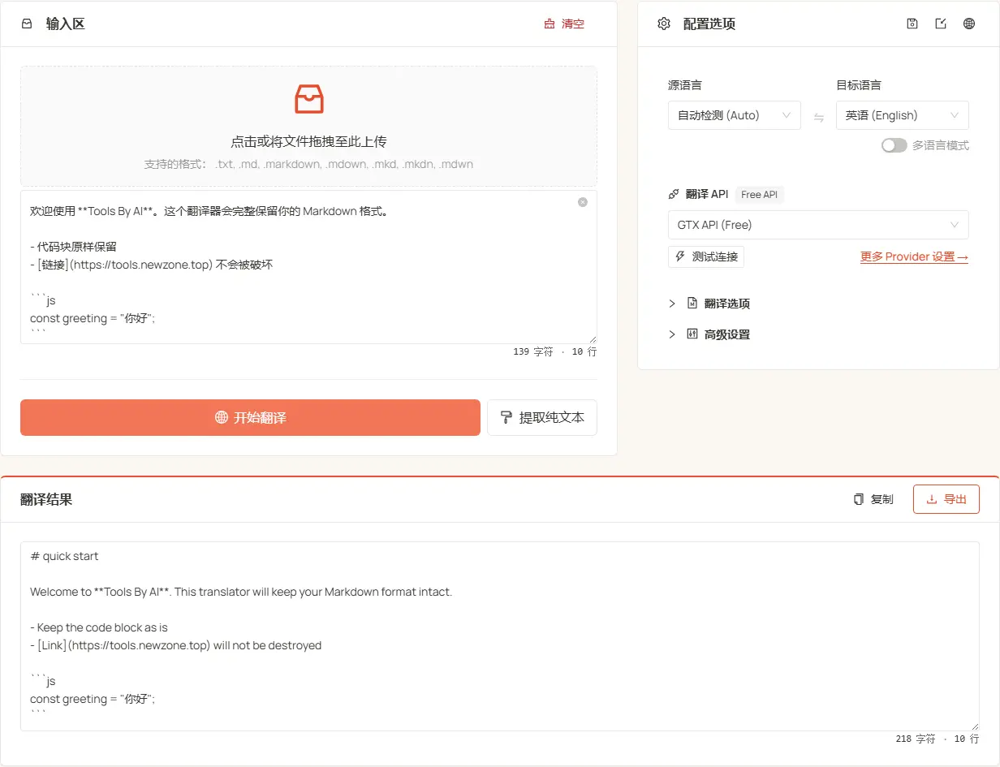

<h1 align="center">
⚡️ Markdown Translator
</h1>
<p align="center">
    <a href="./README.md">English</a> | 中文
</p>
<p align="center">
    <em>翻译 Markdown 不破坏格式 — 标题、代码、公式全保留</em>
</p>

<p align="center">
  <a href="LICENSE"></a>
  <a href="https://tools.newzone.top/zh/md-translator"></a>
</p>

**MD Translator** 专为解决 Markdown 翻译时格式错乱的痛点而生。在高质量翻译的同时完整保留所有 Markdown 结构 —— 代码块、LaTeX 公式、FrontMatter 元数据、链接、强调统统不变。接入 7 种传统翻译 API（DeepL、Google、Azure、DeepLX、Qwen-MT、TranslateGemma、GTX）和 17+ 种 LLM —— 共 25+ 种引擎，支持同时翻译为 120+ 种语言。全程在浏览器本地运行：原文不出本机，API Key 仅存本地。

👉 **在线体验**：<https://tools.newzone.top/zh/md-translator>



## 核心特性

- **格式保留**：把 FrontMatter、代码块、LaTeX、链接、图片路径、标题、列表、引用、HTML/JSX 标签先 tokenize 成占位符，翻译完无损还原。
- **原生 Markdown 支持**：只翻译散文层；标题、列表、代码块、链接、强调和 LaTeX 全部 byte-perfect。完整支持 CommonMark + GFM（表格、任务列表、删除线），并把 MDX、Astro 组件标签作为整块占位符保护。
- **纯文本模式**：打开「忽略格式」开关跳过格式解析，直接翻译 TXT / HTML / 日志等任意文本，避免分词器过度保护；复杂 MDX 也可按纯文本整体翻译。
- **批量上传**：拖入整个 `docs/` 目录一键翻译，每个文件独立导出，可直接放回 Hugo、Jekyll、Hexo、VitePress、Docusaurus 的多语言目录。
- **多语言输出**：一次翻译为 120+ 种语言，每个语言独立导出。
- **上下文关联翻译**（仅 LLM）：每批携带前后段落作为上下文，提升段落连贯性和术语一致性；可自定义 system / user 提示词锁定术语与风格。
- **自动适配 RTL 语言**：自动识别并调整阿拉伯语、希伯来语、乌尔都语、波斯语等 RTL 语言的显示方向。
- **无上限缓存**（IndexedDB）：所有翻译结果本地缓存，无浏览器存储容量限制。
- **文本提取**：剥离 Markdown 语法，得到纯净的文本，便于摘要、NLP 或搜索索引。
- **本地运行 / 隐私优先**：读取、解析、翻译全在浏览器内完成；LLM 请求直接从浏览器发往你配置的端点，原文不经服务器，API Key 仅存本地。
- **多语言界面**：基于 next-intl，支持 18 种界面语言。

## 支持的 Markdown 元素

| 元素                | 语法                       | 保护    |
| ------------------- | -------------------------- | ------- |
| FrontMatter 元数据  | `---` 块                   | 可选    |
| 标题                | `#` … `######`             | ✅      |
| 列表 / 任务列表     | `-` / `*` / `1.` / `- [ ]` | ✅      |
| 表格                | `\| 列 \| 列 \|`           | ✅      |
| 引用块              | `> 引用`                   | ✅      |
| 链接和图片路径      | `[text](url)`、`` | ✅   |
| 强调                | `**加粗**`、`_斜体_`、`~~删除~~` | 内联 |
| 代码块 / 内联代码   | ` ``` ` 和 `` ` ``         | 可选    |
| 行内 / 块级 LaTeX   | `$公式$`、`$$公式$$`       | 可选    |
| HTML / JSX 及 MDX 组件 | `<span>`、`<br/>`、`<Alert>` | ✅   |

FrontMatter、代码块、LaTeX 公式都可独立开关 —— 是否翻译完全由用户控制。MDX、Astro 组件标签作为整块占位符保护，标签之间的纯文本照常翻译。

## 翻译接口

支持 **7 种传统翻译 API** 和 **17+ 种 LLM 服务**：

### 传统翻译 API

| API 类型             | 翻译质量 | 稳定性 | 免费额度                        |
| -------------------- | -------- | ------ | ------------------------------- |
| **DeepL**            | ★★★★★    | ★★★★☆  | 每月 50 万字符                  |
| **Google Translate** | ★★★★☆    | ★★★★★  | 每月 50 万字符                  |
| **Azure Translate**  | ★★★★☆    | ★★★★★  | **前 12 个月** 每月 200 万字符  |
| **DeepLX（免费）**   | ★★★★☆    | ★★★☆☆  | 自部署或公共免费节点            |
| **Qwen-MT**          | ★★★★☆    | ★★★★☆  | 阿里云百炼（DashScope）配额     |
| **TranslateGemma**   | ★★★★☆    | ★★★★☆  | 自部署（LM Studio / Ollama 等） |
| **GTX API（免费）**  | ★★★☆☆    | ★★★☆☆  | 免费（有频率限制）              |

### AI 大模型

支持 **DeepSeek**、**OpenAI**、**Claude**、**Gemini**、**Qwen**、**Moonshot**、**Doubao**、**Zhipu GLM**、**MiniMax**、**Mistral**、**Perplexity**、**Cohere**、**OpenRouter**、**Groq**、**SiliconFlow**、**Nvidia NIM**、**Azure OpenAI**，以及任意 **Custom (OpenAI-compatible)** 端点（Ollama / LM Studio / vLLM / Together AI / Fireworks AI 等）。每个 provider 都支持自定义模型列表、temperature、system / user prompt 以及思考模式开关。

## 上下文关联翻译（仅 LLM）

LLM 模式可在每一批请求里携带前后文，提升段落级连贯性和术语一致性。

- **并发行数**：同时翻译的最大行数（默认 20）。过高可能触发速率限制。
- **上下文行数**：每批携带的上下文行数（默认 50）。值越大连贯性越好，但 token 消耗也越多。

⚠️ **注意**：Markdown 结构复杂，开启上下文模式可能略微增加格式错误的概率（代码块未闭合、列表缩进偏移等）。请仔细检查输出，尤其是深层嵌套文档。

## 适用场景

- 📚 多语言技术文档批量翻译
- 🌐 开源项目文档的 i18n（VitePress / Docusaurus `i18n.locales`）
- 📄 翻译 GitHub README 或整个文档站，翻译完直接放回源目录
- ✍️ Markdown 博客中英双语同步（Hugo / Jekyll / Hexo）
- 🧮 混合文档（文本 + 代码 + 公式）格式保留翻译
- 🔍 剥离 Markdown 得到纯文本，用于摘要 / NLP / 搜索索引

## 常见问题

**技术文档该用哪种引擎？**
强烈推荐 AI 大模型——能识别上下文里的库名、函数名、变量名不乱译。Claude Sonnet 在 API 文档术语精度上领先，DeepSeek 性价比极高，Gemini 凭借超长上下文适合整本书级文档。传统机器翻译只适合快速预览。

**代码块和公式如何保持不变？**
采用占位符保护策略：代码块、内联代码、LaTeX（`$...$`、`$$...$$`）、链接 URL、图片路径、HTML/JSX 标签会先替换成占位符（如 `<<<MULTILINE_CODE_x>>>`）再送翻译，翻译完原样还原。FrontMatter 默认跳过；FrontMatter、代码块、LaTeX、链接文本均有独立开关。

**支持 GFM、MDX、Astro 吗？**
标准 CommonMark 和 GFM（表格、任务列表、删除线、围栏代码块）全支持。MDX、Astro 的组件标签作为整块占位符保护，标签之间的纯文本照常翻译；复杂 MDX 可打开「忽略格式」按纯文本翻译。

**内容会上传到服务器吗？**
不会。读取、解析、翻译全在浏览器端完成。LLM 请求直接从浏览器发往你配置的 API 端点，API Key 仅保存在本地浏览器存储，翻译缓存使用 IndexedDB。

**字幕或 JSON 配置文件怎么办？**
请用配套工具——字幕翻译器（SRT/ASS/VTT/LRC）和 JSON 翻译（i18next / next-intl / vue-i18n），三者共享同一套引擎配置和 API Key，无需重复设置。

## 技术栈

- **框架**：[Next.js 16](https://nextjs.org/)（App Router）+ React 19 with React Compiler
- **UI**：[Ant Design 6](https://ant.design/) + [Tailwind CSS 4](https://tailwindcss.com/)
- **i18n**：[next-intl](https://next-intl-docs.vercel.app/)
- **缓存**：[idb](https://github.com/jakearchibald/idb)（IndexedDB）
- **测试**：[Vitest](https://vitest.dev/) —— `restorePlaceholders` 等占位符工具均有单元测试

## 快速开始

### 环境要求

- Node.js >= 20.9.0
- Yarn（推荐）、npm 或 pnpm

### 安装与启动

```bash
git clone https://github.com/rockbenben/md-translator.git
cd md-translator

yarn install
yarn dev
```

打开 [http://localhost:3000](http://localhost:3000) 即可使用。

### 构建生产版本

```bash
yarn build
```

## 文档与部署

详细配置、API 设置和自托管说明，请参阅 **[官方文档](https://docs.newzone.top/guide/translation/md-translator/)**。

**快速部署**：[部署指南](https://docs.newzone.top/guide/translation/md-translator/deploy.html)

## 参与贡献

欢迎通过 Issue 或 Pull Request 参与贡献！

1. Fork 本仓库并创建功能分支
2. 本地执行 `yarn` 与 `yarn dev`
3. 适当补充测试 / 文档
4. 提交 PR 并清晰描述变更

## 许可协议

MIT © 2025 [rockbenben](https://github.com/rockbenben)。详见 [LICENSE](./LICENSE)。
