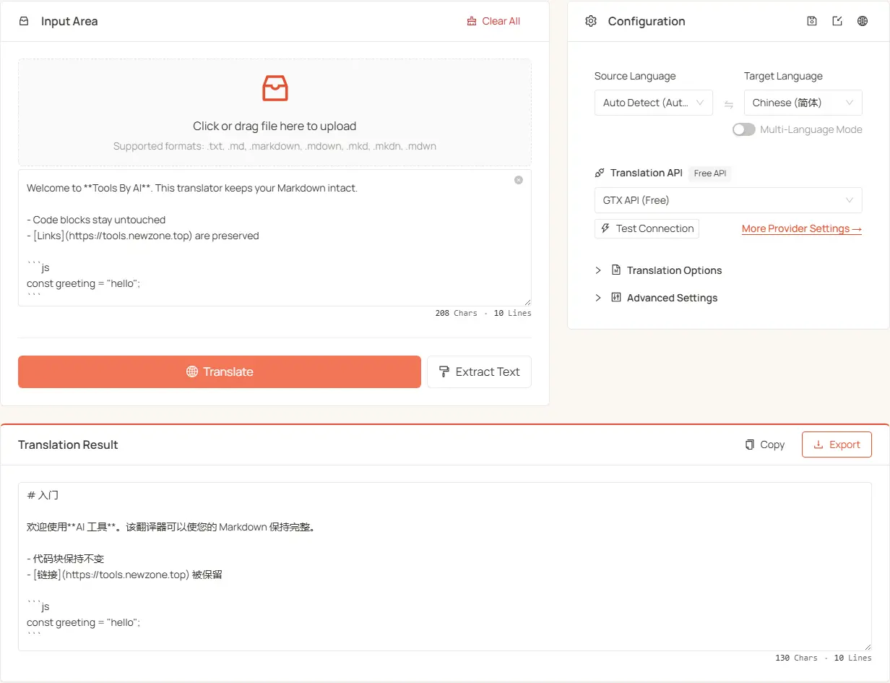

<h1 align="center">
⚡️ Markdown Translator
</h1>
<p align="center">
    English | <a href="./README-zh.md">中文</a>
</p>
<p align="center">
    <em>Translate Markdown & preserve every format — headings, code, formulas, all intact</em>
</p>

<p align="center">
  <a href="LICENSE"></a>
  <a href="https://tools.newzone.top/en/md-translator"></a>
</p>

**MD Translator** solves the broken-formatting problem that plagues Markdown translation. It delivers high-quality translations while accurately preserving every Markdown construct — code blocks, LaTeX formulas, FrontMatter metadata, links, and emphasis all stay intact. Connect to 7 traditional translation APIs (DeepL, Google, Azure, DeepLX, Qwen-MT, TranslateGemma, GTX) or 17+ LLM providers — 25+ engines in total — and translate into 120+ languages simultaneously. Everything runs locally in your browser: your source never leaves your machine and API keys stay in local storage.

👉 **Try it online**: <https://tools.newzone.top/en/md-translator>



## Key Features

- **Format-Preserving**: Tokenize FrontMatter, code blocks, LaTeX, links, image paths, headings, lists, blockquotes, and HTML/JSX tags into placeholders; restore them losslessly after translation.
- **Native Markdown Support**: Translates only the prose layer; headings, lists, code blocks, links, emphasis, and LaTeX stay byte-perfect. Full CommonMark + GFM (tables, task lists, strikethrough) support, plus opaque-block handling for MDX and Astro components.
- **Plain Text Mode**: Toggle "Ignore Formatting" to skip format parsing for plain text inputs (TXT, HTML, logs) — useful when the Markdown tokenizer would over-protect, or for complex MDX you want to translate verbatim.
- **Batch File Upload**: Drop a whole `docs/` directory and translate every file in one click — each translated file exports separately, ready to drop back into Hugo, Jekyll, Hexo, VitePress, or Docusaurus i18n folders.
- **Multi-Language Output**: Translate to 120+ languages in one pass — each language exported as its own file.
- **Context-Aware Translation** (LLM only): Surrounding paragraphs included as context for better coherence and terminology consistency. Custom system / user prompts let you lock in terminology and style.
- **RTL Language Support**: Automatically detects and adjusts text direction for RTL languages such as Arabic, Hebrew, Urdu, and Persian.
- **Unlimited Caching** (IndexedDB): All translations cached locally with no browser-storage size limit.
- **Text Extraction**: Strip Markdown syntax to clean plain text for summarization, NLP, or search indexing.
- **Runs Locally / Privacy-First**: All reading, parsing, and translation happen in your browser. LLM requests go straight from your browser to your configured endpoint; source content never touches our servers and API keys live only in local storage.
- **Multi-Locale UI**: Powered by next-intl, with full UI translation across 18 languages.

## Supported Markdown Elements

| Element                        | Syntax                            | Protected |
| ------------------------------ | --------------------------------- | --------- |
| FrontMatter metadata           | `---` block                       | Optional  |
| Headings                       | `#` … `######`                    | ✅        |
| Lists / task lists             | `-` / `*` / `1.` / `- [ ]`        | ✅        |
| Tables                         | `\| col \| col \|`                | ✅        |
| Blockquotes                    | `> quote`                         | ✅        |
| Links & image paths            | `[text](url)`, ``     | ✅        |
| Emphasis                       | `**bold**`, `_italic_`, `~~del~~` | Inline    |
| Code blocks / inline code      | ` ``` ` and `` ` ``               | Optional  |
| Inline / block LaTeX           | `$formula$`, `$$formula$$`        | Optional  |
| HTML / JSX & MDX components     | `<span>`, `<br/>`, `<Alert>`      | ✅        |

FrontMatter, code blocks, and LaTeX formulas can be translated or kept as-is — each is an independent toggle. MDX and Astro component tags are protected as opaque blocks while plain text between them is translated normally.

## Translation APIs

Supports **7 traditional MT APIs** and **17+ LLM providers**:

### Traditional APIs

| API                  | Quality | Stability | Free Tier                             |
| -------------------- | ------- | --------- | ------------------------------------- |
| **DeepL**            | ★★★★★   | ★★★★☆     | 500K chars/month                      |
| **Google Translate** | ★★★★☆   | ★★★★★     | 500K chars/month                      |
| **Azure Translate**  | ★★★★☆   | ★★★★★     | 2M chars/month (first 12 months)      |
| **DeepLX (Free)**    | ★★★★☆   | ★★★☆☆     | Self-host or free public endpoints    |
| **Qwen-MT**          | ★★★★☆   | ★★★★☆     | Alibaba DashScope quota               |
| **TranslateGemma**   | ★★★★☆   | ★★★★☆     | Self-host (LM Studio / Ollama / etc.) |
| **GTX API (Free)**   | ★★★☆☆   | ★★★☆☆     | Free (rate-limited)                   |

### LLM Providers

Supports **DeepSeek**, **OpenAI**, **Claude**, **Gemini**, **Qwen**, **Moonshot**, **Doubao**, **Zhipu GLM**, **MiniMax**, **Mistral**, **Perplexity**, **Cohere**, **OpenRouter**, **Groq**, **SiliconFlow**, **Nvidia NIM**, **Azure OpenAI**, plus any **Custom (OpenAI-compatible)** endpoint (Ollama / LM Studio / vLLM / Together AI / Fireworks AI etc.). Each provider has a configurable model list, temperature, system / user prompts, and per-request thinking-mode toggle.

## Context-Aware Translation (LLM only)

LLM modes can send surrounding lines as context for each batch, improving paragraph-level coherence and terminology consistency.

- **Concurrent Lines**: max lines translated in parallel (default 20). Too high triggers rate limits.
- **Context Lines**: lines included per batch as context (default 50). Higher = better coherence but more tokens.

⚠️ **Caveat**: Markdown is complex — enabling context mode may slightly raise the risk of formatting errors (unclosed code blocks, list indentation drift). Spot-check output, especially for documents with deeply nested structure.

## Use Cases

- 📚 Translate multilingual technical documentation in bulk
- 🌐 Open-source project documentation i18n (VitePress / Docusaurus `i18n.locales`)
- 📄 Localize a GitHub README or an entire doc site, then drop files straight back into the source tree
- ✍️ Bilingual Markdown blog content sync (Hugo / Jekyll / Hexo)
- 🧮 Format-preserving translation of mixed content (text + code + formulas)
- 🔍 Strip Markdown to plain text for summarization / NLP / search indexing

## FAQ

**Which engine should I use for technical docs?**
AI/LLM is strongly recommended — models recognize library names, function names, and variables in context without mistranslating them. Claude Sonnet leads on API-doc terminology accuracy, DeepSeek delivers excellent value, and Gemini fits book-length documentation thanks to its long context. Traditional machine translation is best reserved for quick previews.

**How are code blocks and formulas kept intact?**
A placeholder-protection strategy: code fences, inline code, LaTeX (`$...$`, `$$...$$`), link URLs, image paths, and HTML/JSX tags are swapped for placeholders (e.g. `<<<MULTILINE_CODE_x>>>`) before translation, then restored verbatim. FrontMatter is skipped by default; separate toggles control FrontMatter, code blocks, LaTeX, and link text.

**Does it support GFM, MDX, or Astro?**
Standard CommonMark and GFM (tables, task lists, strikethrough, fenced code) are fully supported. For MDX and Astro, component tags are treated as opaque blocks while plain-text content between them is translated; flip "Ignore Formatting" to translate complex MDX as plain text.

**Is my content uploaded to a server?**
No. Reading, parsing, and translation all run client-side. LLM requests go directly from your browser to your configured API endpoint, and API keys are stored only in local browser storage. Translation cache uses IndexedDB.

**What about subtitles or JSON config files?**
Use the companion tools — Subtitle Translator (SRT/ASS/VTT/LRC) and JSON Translator (i18next / next-intl / vue-i18n) — which share the same engine configs and API keys, so no re-setup is needed.

## Tech Stack

- **Framework**: [Next.js 16](https://nextjs.org/) (App Router) + React 19 with the React Compiler
- **UI**: [Ant Design 6](https://ant.design/) + [Tailwind CSS 4](https://tailwindcss.com/)
- **i18n**: [next-intl](https://next-intl-docs.vercel.app/)
- **Caching**: [idb](https://github.com/jakearchibald/idb) (IndexedDB)
- **Testing**: [Vitest](https://vitest.dev/) — `restorePlaceholders` and other placeholder utilities ship with unit tests

## Getting Started

### Requirements

- Node.js >= 20.9.0
- Yarn (recommended), npm, or pnpm

### Install & Run

```bash
git clone https://github.com/rockbenben/md-translator.git
cd md-translator

yarn install
yarn dev
```

Visit [http://localhost:3000](http://localhost:3000).

### Production Build

```bash
yarn build
```

## Documentation & Deployment

For detailed configuration, API setup, and self-hosting instructions, see the **[Official Documentation](https://docs.newzone.top/en/guide/translation/md-translator/)**.

**Quick Deployment**: [Deploy Guide](https://docs.newzone.top/en/guide/translation/md-translator/deploy.html)

## Contributing

Contributions are welcome! Feel free to open issues and pull requests.

1. Fork the repo and create a feature branch
2. Run `yarn` and `yarn dev` locally
3. Add tests / docs when applicable
4. Submit a PR with a clear description

## License

MIT © 2025 [rockbenben](https://github.com/rockbenben). See [LICENSE](./LICENSE).
