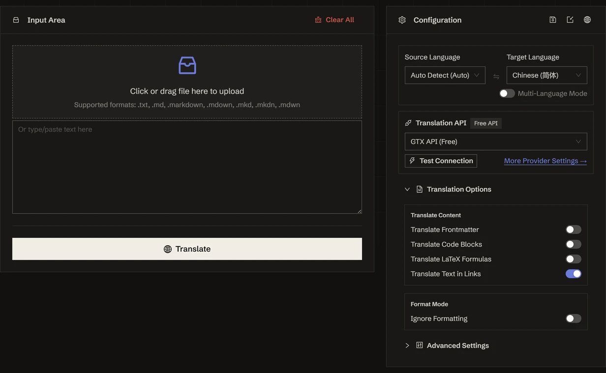

<h1 align="center">
⚡️ Markdown Translator
</h1>
<p align="center">
    <em>Translate Markdown into 120+ languages — code, LaTeX and front matter come out untouched</em>
</p>

<p align="center">
    <b>English</b> · <a href="./README.zh.md">简体中文</a>
</p>

<p align="center">
  <a href="LICENSE"></a>
  <a href="https://tools.newzone.top/en/md-translator"></a>
</p>

Run a Markdown file through a general-purpose translator and you get your code blocks translated, `$E = mc^2$` turned into prose, front-matter keys renamed, and the URLs inside your links rewritten. MD Translator swaps every one of those constructs for a placeholder **before** anything is sent — the engine only ever sees the prose — then puts them back verbatim.

**MD Translator** is a free, browser-based Markdown translator for `.md`, `.markdown`, `.mdx`, and plain text. Drop a whole `docs/` directory in at once, connect 9 traditional translation APIs (DeepL, Google, Azure, DeepLX, Qwen-MT, TranslateGemma, MiLMMT, GTX, Edge) or 26 LLM providers and gateways, and translate into 120+ languages — or into several target languages in one pass, each exported as its own file, ready to drop back into Hugo, VitePress, or Docusaurus. Everything runs locally in your browser; source content and API keys never touch a server. A [CLI](#command-line) drives the same engine headlessly when you'd rather script it.

👉 **Try it online**: <https://tools.newzone.top/en/md-translator>



## What Stays Intact

| Element | Syntax | Default |
| --- | --- | --- |
| Fenced & inline code | ` ``` `, `` `code` `` | Protected (toggle to translate) |
| Inline & block LaTeX | `$formula$`, `$$formula$$` | Protected (toggle to translate) |
| Front matter | `---` YAML block | Protected (toggle to translate) |
| Link URLs & image paths | `[text](url)`, `` | Protected — the URL is never sent |
| Link text | `[text](url)` | Translated (toggle to keep) |
| HTML / JSX / MDX components | `<span>`, `<br/>`, `<Alert>` | Tags protected, text between them translated |
| Headings, lists, tables, quotes | `#`, `-`, `1.`, `\| \|`, `>` | Markers protected, prose translated |
| Emphasis | `**bold**`, `_italic_`, `~~del~~` | Kept inline |

Full CommonMark + GFM (tables, task lists, strikethrough). MDX and Astro component tags are treated as opaque blocks. For anything the tokenizer over-protects — messy MDX, HTML, TXT, logs — flip **Ignore formatting** and the raw text is translated as-is.

## Key Features

- **Format-Preserving**: Front matter, code, LaTeX, links, image paths, headings, lists, blockquotes, and HTML/JSX become placeholders before translation and are restored losslessly after. Four independent toggles decide what gets translated anyway.
- **Batch File Upload**: Drop an entire `docs/` directory and translate every file in one click; each file exports separately with its original filename, and the run ends with an aggregated success / failure summary.
- **Multi-Language Output**: Translate into several target languages in a single pass — each language exported as its own file with the language code appended (e.g. `guide.zh.md`, `guide.fr.md`).
- **Ignore Formatting**: Skip Markdown parsing entirely for plain text, HTML, logs, or MDX you want translated verbatim.
- **Glossary**: Lock product names, API terms, and character names to a fixed translation across every file — enforced in-prompt on LLM engines and re-checked against the output.
- **Context-Aware Translation** (LLM only): Send surrounding paragraphs with each batch for better coherence. Note that it runs in plain-text mode — see [below](#context-aware-translation-llm-only).
- **Text Extraction**: Strip Markdown syntax down to clean prose for summarization, NLP, or search indexing.
- **RTL Language Support**: Text direction auto-adjusts for Arabic, Hebrew, Urdu, and Persian.
- **Unlimited Caching** (IndexedDB): Every translated line is cached locally with no browser-storage size limit; refreshing the page doesn't lose translated files.
- **Command Line**: `yarn cli` runs the same engine, parsers, and cache from a terminal — see [Command Line](#command-line).
- **Multi-Locale UI**: Powered by next-intl, with full UI translation across 18 languages.
- **Private by Design**: Fully client-side — source content and API keys stay in your browser; LLM requests go directly from your browser to the API endpoint you configure.

## Translation APIs

Supports **9 traditional MT APIs** and **26 LLM providers and gateways**.

### Traditional APIs

| API | Quality | Stability | Free Tier |
| --- | --- | --- | --- |
| **DeepL** | ★★★★★ | ★★★★☆ | 500K chars/month |
| **Google Translate** | ★★★★☆ | ★★★★★ | 500K chars/month |
| **Azure Translate** | ★★★★☆ | ★★★★★ | 2M chars/month (first 12 months) |
| **DeepLX (Free)** | ★★★★☆ | ★★★☆☆ | Self-host or free public endpoints |
| **Qwen-MT** | ★★★★☆ | ★★★★☆ | Alibaba DashScope quota |
| **TranslateGemma** | ★★★★☆ | ★★★★☆ | Self-host (LM Studio / llama.cpp / etc.) |
| **MiLMMT** | ★★★★☆ | ★★★★☆ | Self-host (LM Studio / llama.cpp / etc.) |
| **GTX API (Free)** | ★★★☆☆ | ★★★☆☆ | Free (rate-limited) |
| **Edge API (Free)** | ★★★★☆ | ★★★☆☆ | Free (rate-limited) |

GTX and Edge need no configuration at all — they are the zero-setup defaults, and each is the other's fallback.

### LLM Providers

**DeepSeek**, **OpenAI**, **Claude**, **Gemini**, **Qwen**, **Kimi (Moonshot)**, **Doubao (Volcengine)**, **Xiaomi MiMo**, **Zhipu GLM**, **MiniMax**, **StepFun**, **Baidu ERNIE (Qianfan)**, **Mistral**, **xAI (Grok)**, **Cohere**, and **YandexGPT**.

### Gateways

**OpenRouter**, **OpenCode Zen**, **TokenHub (Tencent)**, **Groq**, **Cerebras**, **SiliconFlow**, **Atlas Cloud**, **Nvidia NIM**, **Azure OpenAI**, plus any **Custom (OpenAI-compatible)** endpoint (Ollama / LM Studio / vLLM / LiteLLM / Together AI / Fireworks AI etc.).

Providers walled off from browsers by CORS can be routed through an API relay. The built-in relay works out of the box; **API Settings → Relay address** points every relayed provider at your own deployment of the relay Worker instead.

LLM modes give you:

- **Best for**: technical documentation, API references, tutorials, mixed prose + code
- **Customization**: configure system / user prompts to lock in terminology and style
- **Temperature Control**: adjust AI creativity (0–1 scale)
- **Thinking Mode**: per-provider toggle for reasoning-capable models

## Context-Aware Translation (LLM only)

LLM modes can send surrounding lines as context for each batch, improving paragraph-level coherence and terminology consistency.

- **Concurrent Lines**: max lines translated in parallel (default 20). Too high triggers rate limits.
- **Context Lines**: lines included per batch as context (default 50). Higher = better coherence but more tokens.

⚠️ **Context mode and placeholder protection are mutually exclusive.** Turning it on switches the run to plain-text mode — Markdown is no longer tokenized, so code fences and list indentation can drift. It is **off by default** for Markdown: leave it off for technical docs, turn it on for prose-heavy content where coherence matters more than structure.

## FAQ

**Which engine should I use for technical docs?** An LLM. Models recognize library names, function names, and variables in context instead of translating them. Claude Sonnet leads on API-doc terminology accuracy, DeepSeek is the value pick for whole doc sites, and Gemini's long context handles book-length documents. Traditional MT is best reserved for quick previews.

**How are code blocks and formulas kept intact?** Placeholder protection: code fences, inline code, LaTeX, link URLs, image paths, and HTML/JSX tags are swapped for placeholders (e.g. `<<<MULTILINE_CODE_0>>>`) before translation, then restored verbatim. The engine never sees them, so no "please preserve the code" prompt is needed.

**Does it support GFM, MDX, or Astro?** CommonMark and GFM (tables, task lists, strikethrough, fenced code) are fully supported. For MDX and Astro, component tags are opaque blocks while plain text between them is translated; flip **Ignore formatting** to translate complex MDX verbatim.

**How do I localize a whole VitePress / Docusaurus site?** Batch-upload the `docs/` directory. Enable **Translate front matter** if `title` / `description` need translating — `slug` and `permalink` stay put. Drop the exported files back into the source tree and your framework picks them up via its `i18n.locales` config.

**How do I keep product and API names consistent?** Add a glossary. It is enforced in-prompt on every LLM engine and re-checked against the output, so the same term renders identically across every file in the batch.

**Is it private?** Yes. Reading, parsing, and translation all run client-side. API keys are stored only in local browser storage, and LLM requests go directly from your browser to your configured endpoint. The translation cache lives in your browser's IndexedDB.

See the [full FAQ in the docs](https://docs.newzone.top/en/guide/translation/md-translator/) for more.

## Command Line

`yarn cli` translates files headlessly over the **same** engine as the web app — same parsers, same retry and rate-limit handling, same cache keys. Configure the service once in the browser, hit **Export settings**, and hand the JSON to the CLI; nothing has to be re-entered.

```bash
yarn install   # once

# A whole docs directory into Chinese on the free GTX API — no key, no config.
yarn cli -i docs/guide.md -i docs/api.md -t zh

# Two targets in one pass, using your exported keys/prompts/glossary.
yarn cli -i README.md -t ja -t ko -s ~/md-settings.json -o out/

# A local model — nothing leaves the machine.
yarn cli -i guide.mdx -t zh -m llm --url http://localhost:11434/v1 --model qwen3

# Translate front matter too, and keep link labels in the source language.
yarn cli -i post.md -t de -m deepseek --md-translate-frontmatter --md-no-link-text
```

Output lands beside the input (or in `-o <dir>`) as `guide.zh.md`.

| Option | Meaning |
| --- | --- |
| `-i, --input <file>` | Input file. Repeatable. |
| `-t, --to <lang>` | Target language. Repeatable. Default `zh`. |
| `-f, --from <lang>` | Source language. Default `auto`. |
| `-m, --method <id>` | Service id. Default `gtxFreeAPI`; `--list-methods` prints them all. |
| `-s, --settings <file>` | Settings JSON exported from the web UI (keys, prompts, glossary, retry…). |
| `-o, --out-dir <dir>` | Output directory. Default: next to each input. |
| `--api-key` · `--url` · `--model` | One-off overrides for the chosen service. |
| `--md-raw` | Translate raw lines instead of protecting code / links / LaTeX. |
| `--md-translate-frontmatter` · `--md-translate-code` · `--md-translate-latex` | Translate those parts (protected by default). |
| `--md-no-link-text` | Keep `[link text](url)` labels untranslated (translated by default). |
| `--context` · `--no-context` | Context-aware LLM batching. Off by default for Markdown; `--context` implies `--md-raw`. |
| `--no-cache` · `--cache-file <file>` | Cache control. Default `~/.translate-cli-cache.json`. |
| `--relay` · `--no-relay` | Route through the API relay. Off by default — Node has no CORS to work around. |
| `--format <fmt>` | Force a format instead of inferring it from the extension. |

Markdown is not the only input: the same command handles subtitles (`.srt`, `.ass`, `.vtt`, `.lrc`, `.sbv` — timecodes stripped locally) and JSON locale files (`.json` — keys untouched, values translated). `yarn cli --list-formats` prints the mapping, `yarn cli --help` the full option list.

Runs are resumable: every translated line is cached, so re-running after a `Ctrl-C`, a rate-limit wall, or a handful of failed lines only pays for what is still missing.

Exit codes: `0` everything translated · `1` finished but some lines soft-failed (kept as source text in the output) or a file failed · `2` bad invocation · `130` cancelled.

## Run It Yourself

Node.js >= 20.9.0 and Yarn (or npm / pnpm).

```bash
git clone https://github.com/rockbenben/md-translator.git
cd md-translator

yarn install
yarn dev        # http://localhost:3000
yarn build      # production build
```

## Documentation & Deployment

For detailed configuration, API setup, and self-hosting instructions, see the **[Official Documentation](https://docs.newzone.top/en/guide/translation/md-translator/)**.

**Quick Deployment**: [Deploy Guide](https://docs.newzone.top/en/guide/translation/md-translator/deploy.html)

## Contributing

Contributions are welcome! Feel free to open issues and pull requests.

1. Fork the repo and create a feature branch
2. Run `yarn` and `yarn dev` locally
3. Add tests / docs when applicable
4. Submit a PR with a clear description
