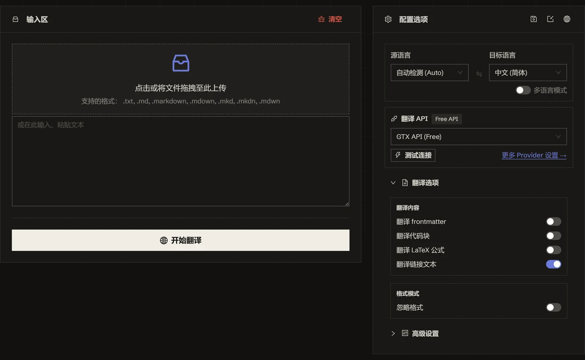

<h1 align="center">
⚡️ Markdown Translator
</h1>
<p align="center">
    <em>把 Markdown 翻成 120+ 种语言，代码、公式、Front Matter 原封不动</em>
</p>

<p align="center">
    <a href="./README.md">English</a> · <b>简体中文</b>
</p>

<p align="center">
  <a href="LICENSE"></a>
  <a href="https://tools.newzone.top/zh/md-translator"></a>
</p>

把 Markdown 丢进通用翻译器，代码块会被一起翻掉，`$E = mc^2$` 被译成大白话，Front Matter 的键名被改名，链接里的 URL 也会被重写。Markdown 翻译器在发送**之前**就把这些结构全部换成占位符——引擎从头到尾只看得到正文——译完再原样还原。

**MD Translator** 是一款免费、纯浏览器运行的 Markdown 翻译工具，支持 `.md`、`.markdown`、`.mdx` 与纯文本。可一次性拖入整个 `docs/` 目录，接入 9 种传统翻译 API（DeepL、Google、Azure、DeepLX、Qwen-MT、TranslateGemma、MiLMMT、GTX、Edge）和 26 种 LLM 与网关，覆盖 120+ 种语言——还能一次翻译成多种目标语言，每种语言各导出为独立文件，直接放回 Hugo、VitePress、Docusaurus 的目录即可。全程在浏览器本地完成，原文与 API Key 不经过服务器。想脚本化批处理，还有一个共用同一套引擎的[命令行工具](#命令行)。

👉 **在线体验**：<https://tools.newzone.top/zh/md-translator>



## 哪些内容不会被动

| 元素 | 语法 | 默认行为 |
| --- | --- | --- |
| 代码块与行内代码 | ` ``` `、`` `code` `` | 保护（可开关翻译） |
| 行内与块级 LaTeX | `$formula$`、`$$formula$$` | 保护（可开关翻译） |
| Front Matter | `---` YAML 块 | 保护（可开关翻译） |
| 链接 URL 与图片路径 | `[text](url)`、`` | 保护——URL 从不外发 |
| 链接文字 | `[text](url)` | 翻译（可开关保留） |
| HTML / JSX / MDX 组件 | `<span>`、`<br/>`、`<Alert>` | 标签保护，标签之间的文字照常翻译 |
| 标题、列表、表格、引用 | `#`、`-`、`1.`、`\| \|`、`>` | 标记保护，正文翻译 |
| 强调 | `**bold**`、`_italic_`、`~~del~~` | 内联保留 |

完整支持 CommonMark + GFM（表格、任务列表、删除线）。MDX 与 Astro 组件标签按不透明块处理。遇到分词器保护过度的内容——杂乱的 MDX、HTML、TXT、日志——打开「忽略格式」即可按原始文本直译。

## 核心特性

- **格式无损**：Front Matter、代码、LaTeX、链接、图片路径、标题、列表、引用、HTML/JSX 在翻译前全部换成占位符，译完无损还原。四个独立开关决定哪些部分照样翻译。
- **批量上传**：一次拖入整个 `docs/` 目录，一键翻译全部文件；每个文件以原文件名独立导出，结束时汇总成功 / 失败统计。
- **多语言输出**：一次可翻译成多种目标语言——每种语言各导出为独立文件，并自动追加语言代码（如 `guide.zh.md`、`guide.fr.md`）。
- **忽略格式**：完全跳过 Markdown 解析，用于纯文本、HTML、日志，或想逐字直译的复杂 MDX。
- **术语表**：把产品名、API 术语、人名锁定为固定译法，全批文件一致——在 LLM 引擎上按提示词强制，并对输出再做一次校验。
- **上下文关联翻译**（仅 LLM）：每批携带前后段落，连贯性更好。注意它以纯文本模式运行，详见[下文](#上下文关联翻译仅-llm)。
- **文本提取**：剥离 Markdown 语法，导出干净正文，用于总结、NLP 或搜索索引。
- **RTL 语言支持**：自动识别并调整阿拉伯语、希伯来语、乌尔都语、波斯语的文字方向。
- **无上限缓存**（IndexedDB）：每一行译文本地缓存，无浏览器存储容量限制，刷新页面已译文件不丢失。
- **命令行**：`yarn cli` 在终端跑同一套引擎、解析器与缓存，详见[命令行](#命令行)。
- **多语言界面**：基于 next-intl，支持 18 种界面语言。
- **隐私优先**：完全前端处理——原文与 API Key 仅保存在浏览器；LLM 请求直接从浏览器发往你配置的 API 端点。

## 翻译接口

支持 **9 种传统翻译 API** 和 **26 种 LLM 与网关**。

### 传统翻译 API

| API 类型 | 翻译质量 | 稳定性 | 免费额度 |
| --- | --- | --- | --- |
| **DeepL** | ★★★★★ | ★★★★☆ | 每月 50 万字符 |
| **Google Translate** | ★★★★☆ | ★★★★★ | 每月 50 万字符 |
| **Azure Translate** | ★★★★☆ | ★★★★★ | **前 12 个月** 每月 200 万字符 |
| **DeepLX（免费）** | ★★★★☆ | ★★★☆☆ | 自部署或公共免费节点 |
| **Qwen-MT** | ★★★★☆ | ★★★★☆ | 阿里云百炼（DashScope）配额 |
| **TranslateGemma** | ★★★★☆ | ★★★★☆ | 自部署（LM Studio / llama.cpp 等） |
| **MiLMMT** | ★★★★☆ | ★★★★☆ | 自部署（LM Studio / llama.cpp 等） |
| **GTX API（免费）** | ★★★☆☆ | ★★★☆☆ | 免费（有频率限制） |
| **Edge API（免费）** | ★★★★☆ | ★★★☆☆ | 免费（有频率限制） |

GTX 与 Edge 完全免配置，是开箱即用的默认项，且互为备胎。

### AI 大模型

**DeepSeek**、**OpenAI**、**Claude**、**Gemini**、**Qwen**、**Kimi（Moonshot）**、**Doubao 豆包**、**Xiaomi MiMo**、**Zhipu GLM**、**MiniMax**、**StepFun 阶跃星辰**、**Baidu ERNIE 文心（千帆）**、**Mistral**、**xAI (Grok)**、**Cohere**、**YandexGPT**。

### 聚合网关

**OpenRouter**、**OpenCode Zen**、**TokenHub（腾讯）**、**Groq**、**Cerebras**、**SiliconFlow**、**Atlas Cloud**、**Nvidia NIM**、**Azure OpenAI**，以及任意 **Custom (OpenAI-compatible)** 端点（Ollama / LM Studio / vLLM / LiteLLM / Together AI / Fireworks AI 等）。

被 CORS 挡住浏览器直连的服务可走 API 中转。内置中转开箱即用；**API 设置 → 中转地址** 可把所有开了中转的服务一次性指向你自建的那份中转 Worker。

LLM 模式提供：

- **适用场景**：技术文档、API 参考、教程、正文与代码混排的内容
- **可定制**：支持配置 system / user prompt，锁定术语与风格
- **温度控制**：调节 AI 创造性（0–1）
- **思考模式**：对推理类模型，可按 provider 单独开关

## 上下文关联翻译（仅 LLM）

LLM 模式可在每一批请求里携带前后文，提升段落连贯性与术语一致性。

- **并发行数**：同时翻译的最大行数（默认 20）。过高可能触发速率限制。
- **上下文行数**：每批携带的上下文行数（默认 50）。值越大连贯性越好，但 token 消耗也越多。

⚠️ **上下文模式与占位符保护互斥。** 打开它，整轮翻译切到纯文本模式——Markdown 不再被分词保护，代码围栏与列表缩进可能错乱。Markdown 下它**默认关闭**：技术文档保持关闭，连贯性比结构更重要的长篇散文再打开。

## 常见问题

**技术文档该用哪个引擎？** 用大模型。模型能在上下文里认出库名、函数名与变量，不会把它们一起翻掉。API 文档术语准确度首选 Claude Sonnet，整站文档性价比首选 DeepSeek，超长文档用 Gemini 的大上下文。传统机器翻译更适合快速预览。

**代码块和公式怎么保住的？** 占位符保护：代码围栏、行内代码、LaTeX、链接 URL、图片路径、HTML/JSX 标签在翻译前被换成占位符（如 `<<<MULTILINE_CODE_0>>>`），译完原样还原。引擎从头到尾看不到它们，所以不需要写「请保留代码」之类的提示词。

**支持 GFM、MDX、Astro 吗？** 标准 CommonMark 与 GFM（表格、任务列表、删除线、围栏代码）完整支持。MDX 与 Astro 的组件标签按不透明块处理，标签之间的纯文本照常翻译；复杂 MDX 想逐字直译就打开「忽略格式」。

**怎么本地化整个 VitePress / Docusaurus 站点？** 批量上传 `docs/` 目录。`title` / `description` 需要翻译时打开「翻译 Front Matter」——`slug`、`permalink` 不会被动。导出的文件放回原目录，框架按自己的 `i18n.locales` 配置即可识别。

**产品名、API 名怎么保持一致？** 用术语表。它在每个 LLM 引擎上按提示词强制，并对输出再校验一次，同一术语在整批文件里译法完全一致。

**隐私安全吗？** 安全。读取、解析、翻译全程在浏览器内完成；API Key 仅保存在本地浏览器，LLM 请求直接从浏览器发往你配置的端点，翻译缓存存在浏览器的 IndexedDB 里。

更多说明见 [官方文档完整 FAQ](https://docs.newzone.top/guide/translation/md-translator/)。

## 命令行

`yarn cli` 在终端里跑的是**同一套**引擎——同样的解析器、同样的重试与限流处理、同样的缓存键。在浏览器里配好服务后点「导出设置」，把那份 JSON 交给 CLI 即可，无需重填任何配置。

```bash
yarn install   # 只需一次

# 整个 docs 目录翻成中文，走免费 GTX，无需 key、无需配置
yarn cli -i docs/guide.md -i docs/api.md -t zh

# 一次两种目标语言，复用导出的 key / 提示词 / 术语表
yarn cli -i README.md -t ja -t ko -s ~/md-settings.json -o out/

# 本地模型，数据不出本机
yarn cli -i guide.mdx -t zh -m llm --url http://localhost:11434/v1 --model qwen3

# 连 Front Matter 一起翻，但保留链接文字不译
yarn cli -i post.md -t de -m deepseek --md-translate-frontmatter --md-no-link-text
```

产物默认写在输入文件旁边（或 `-o <dir>`），命名为 `guide.zh.md`。

| 选项 | 说明 |
| --- | --- |
| `-i, --input <file>` | 输入文件，可重复 |
| `-t, --to <lang>` | 目标语言，可重复，默认 `zh` |
| `-f, --from <lang>` | 源语言，默认 `auto` |
| `-m, --method <id>` | 翻译服务，默认 `gtxFreeAPI`；`--list-methods` 列出全部 |
| `-s, --settings <file>` | 网页端导出的设置 JSON（密钥、提示词、术语表、重试参数等） |
| `-o, --out-dir <dir>` | 输出目录，默认与输入同目录 |
| `--api-key` · `--url` · `--model` | 针对当前服务的临时覆盖 |
| `--md-raw` | 按原始行翻译，不保护代码 / 链接 / LaTeX |
| `--md-translate-frontmatter` · `--md-translate-code` · `--md-translate-latex` | 连这些部分也翻译（默认保护） |
| `--md-no-link-text` | 保留 `[链接文字](url)` 不译（默认翻译） |
| `--context` · `--no-context` | 上下文关联批处理。Markdown 默认关闭；`--context` 会连带打开 `--md-raw` |
| `--no-cache` · `--cache-file <file>` | 缓存控制，默认 `~/.translate-cli-cache.json` |
| `--relay` · `--no-relay` | 是否走 API 中转。默认关闭——Node 端没有 CORS 需要绕 |
| `--format <fmt>` | 强制指定格式，不按扩展名推断 |

不止 Markdown：同一条命令也处理字幕（`.srt`、`.ass`、`.vtt`、`.lrc`、`.sbv`，时间轴在本地剥离）和 JSON 多语言文件（`.json`，只译值不动键）。`yarn cli --list-formats` 查看格式映射，`yarn cli --help` 查看完整选项。

翻译可续跑：每一行译文都进缓存，`Ctrl-C` 中断、撞上限流、或只有少数几行失败后再跑一次，只会为还缺的那部分付费。

退出码：`0` 全部译完 · `1` 跑完但有行软失败（输出里保留原文）或有文件失败 · `2` 参数错误 · `130` 已取消。

## 自行部署

需要 Node.js >= 24 与 Yarn（或 npm / pnpm）。

```bash
git clone https://github.com/rockbenben/md-translator.git
cd md-translator

yarn install
yarn dev        # http://localhost:3000
yarn build      # 构建生产版本
```

## 文档与部署

详细配置、API 设置和自托管说明，请参阅 **[官方文档](https://docs.newzone.top/guide/translation/md-translator/)**。

**快速部署**：[部署指南](https://docs.newzone.top/guide/translation/md-translator/deploy.html)

## 参与贡献

欢迎通过 Issue 或 Pull Request 参与贡献！

1. Fork 本仓库并创建功能分支
2. 本地执行 `yarn` 与 `yarn dev`
3. 适当补充测试 / 文档
4. 提交 PR 并清晰描述变更
